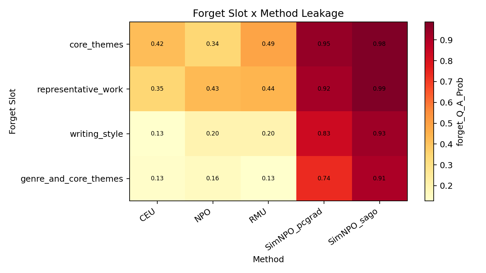
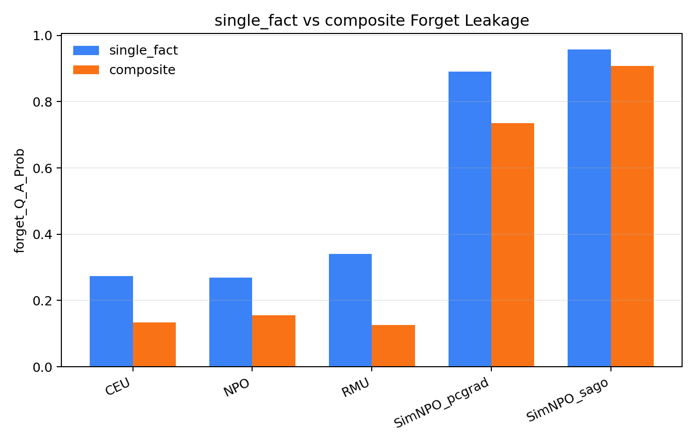
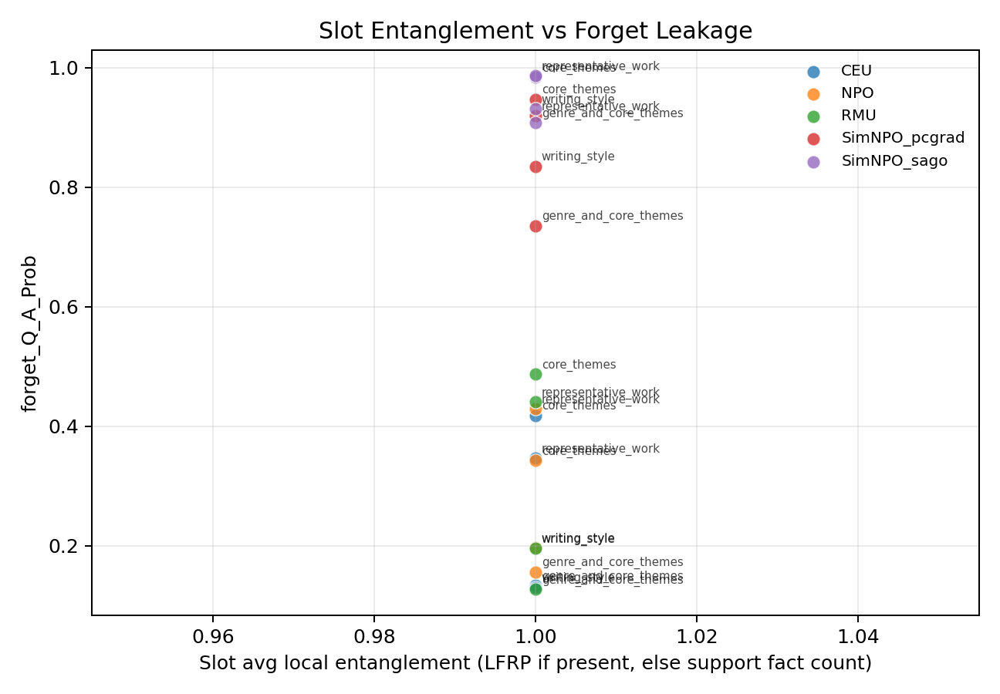

# MYTOFU Slot-level and QA-type-wise Failure Mode Analysis

生成时间：2026-05-10  
模型：Llama-3.2-1B-Instruct  
分析方法：CEU、NPO、RMU、SimNPO_pcgrad、SimNPO_sago  
结果目录：`saves/mytofu_failure_modes`

## 1. 实验目的

本补充实验用于分析 MYTOFU 细粒度遗忘中的失败模式：在整体遗忘分数之外，进一步回答不同知识槽位（slot）和不同 QA 类型下，模型残留知识泄露是否存在结构性差异。实验直接复用已有 `MYTOFU_EVAL.json` 中的 per-sample `value_by_index`，并与 MYTOFU eval jsonl 中的 `primary_slots`、`qa_type`、`support_fact_ids` 对齐，因此不需要重新训练或重新推理。

本次分析覆盖：

- forget 侧：每个方法 40 条样本，包含 4 个 forget slot。
- retain 侧：每个方法 240 条样本。
- 指标：`forget_Q_A_Prob`、`exact_memorization`、`extraction_strength`、`forget_truth_ratio`、`retain_Q_A_Prob`、`retain_truth_ratio`。

## 2. 主要结果文件

- 总表：`mytofu_failure_modes.xlsx`
- per-sample 长表：`per_sample_metric_long.csv`
- slot 聚合表：`slot_metric_wide.csv`
- QA type 聚合表：`qa_type_metric_wide.csv`
- Top hardest slots：`top_hardest_slots.csv`
- 图 1：`fig1_forget_slot_method_heatmap.png`
- 图 2：`fig2_qa_type_forget_leakage.png`
- 图 3：`fig3_slot_entanglement_scatter.png`

## 3. 方法层面的总体趋势

以 `forget_Q_A_Prob` 作为 forget leakage 指标，数值越高代表模型越倾向于继续给出被遗忘答案，遗忘越不干净。各方法在 forget slot 上的平均结果如下：

| Method | Avg forget_Q_A_Prob | Avg exact_memorization | Avg extraction_strength | Avg forget_truth_ratio |
|---|---:|---:|---:|---:|
| CEU | 0.2571 | 0.7130 | 0.1582 | 1.1219 |
| NPO | 0.2810 | 0.8405 | 0.3824 | 8.3503 |
| RMU | 0.3124 | 0.8560 | 0.4560 | 9.2084 |
| SimNPO_pcgrad | 0.8591 | 0.9587 | 0.7728 | 5.1799 |
| SimNPO_sago | 0.9522 | 0.9862 | 0.8452 | 8.7130 |

结论上，CEU 的 forget leakage 最低，其次是 NPO 和 RMU；SimNPO_pcgrad 与 SimNPO_sago 的 retain 侧能力较强，但 forget 侧残留明显更高。这与“高 utility 方法可能保留更多被遗忘知识”的主实验观察一致。

retain 侧平均结果如下：

| Method | Avg retain_Q_A_Prob | Avg retain_truth_ratio |
|---|---:|---:|
| CEU | 0.7039 | 0.3601 |
| NPO | 0.8884 | 0.2304 |
| RMU | 0.8955 | 0.2306 |
| SimNPO_pcgrad | 0.9837 | 0.2445 |
| SimNPO_sago | 0.9874 | 0.2388 |

这说明 CEU 遗忘最强，但 retain utility 损失也最明显；SimNPO 系列 retain 保持最好，但忘不干净。NPO 和 RMU 位于两者之间。

## 4. Slot 维度失败模式

Top hardest forget slots 如下：

| Rank | Slot | Avg Forget Prob | Best Method | Worst Method |
|---:|---|---:|---|---|
| 1 | core_themes | 0.6357 | NPO | SimNPO_sago |
| 2 | representative_work | 0.6243 | CEU | SimNPO_sago |
| 3 | writing_style | 0.4576 | CEU | SimNPO_sago |
| 4 | genre_and_core_themes | 0.4119 | RMU | SimNPO_sago |

slot-method 热力图见：

更细的 slot x method 结果如下：

| Slot | CEU | NPO | RMU | SimNPO_pcgrad | SimNPO_sago |
|---|---:|---:|---:|---:|---:|
| core_themes | 0.4180 | 0.3428 | 0.4866 | 0.9470 | 0.9841 |
| genre_and_core_themes | 0.1337 | 0.1562 | 0.1269 | 0.7353 | 0.9074 |
| representative_work | 0.3467 | 0.4286 | 0.4405 | 0.9194 | 0.9862 |
| writing_style | 0.1301 | 0.1964 | 0.1954 | 0.8347 | 0.9312 |

从 slot 维度看，`core_themes` 和 `representative_work` 是最难遗忘的两类知识。它们都不是孤立的表面事实，而是与作者画像、作品身份和语义表征高度绑定的知识。相比之下，`genre_and_core_themes` 和 `writing_style` 在 CEU/NPO/RMU 下的泄露更低，但在 SimNPO 系列下仍然明显残留。

## 5. QA Type 维度失败模式

QA type 分组柱状图见：

forget 侧 `forget_Q_A_Prob` 聚合如下：

| QA type | CEU | NPO | RMU | SimNPO_pcgrad | SimNPO_sago |
|---|---:|---:|---:|---:|---:|
| composite | 0.1337 | 0.1562 | 0.1269 | 0.7353 | 0.9074 |
| relation | 0.3467 | 0.4286 | 0.4405 | 0.9194 | 0.9862 |
| single_fact | 0.2740 | 0.2696 | 0.3410 | 0.8909 | 0.9576 |

本次结果中，relation 类型的泄露最高，single_fact 次之，composite 反而最低。这一点和“composite 一定更容易泄露”的预期并不完全一致。更合理的解释是：当前 forget split 中 composite 主要对应 `genre_and_core_themes`，而 relation 主要对应 `representative_work`，因此 QA type 的差异与 slot 差异存在耦合。换言之，本轮结果不能简单归因于“题型本身”，更应表述为“与 representative_work 相关的 relation 问法更容易触发残留知识”。

exact memorization 也呈现类似趋势：

| QA type | CEU | NPO | RMU | SimNPO_pcgrad | SimNPO_sago |
|---|---:|---:|---:|---:|---:|
| composite | 0.5890 | 0.8239 | 0.8282 | 0.9256 | 0.9644 |
| relation | 0.7707 | 0.8820 | 0.9073 | 0.9744 | 1.0000 |
| single_fact | 0.7462 | 0.8281 | 0.8443 | 0.9674 | 0.9903 |

## 6. Slot Entanglement 散点图说明

slot entanglement 散点图见：

需要注意：当前结果中的 forget slot 只有 4 个，并且 `avg_local_entanglement` 与 `avg_support_fact_count` 都为 1.0。因此图 3 目前只能展示不同方法在同一 entanglement 水平下的 leakage 差异，不能支撑“LFRP 越高，slot leakage 越高”的趋势性结论。

如果论文中使用该图，建议谨慎表述为：

> 在当前 split 中，forget slots 的局部 support fact 数量一致，因此散点图主要反映不同方法和 slot 的泄露差异，而非完整的 entanglement-leakage 相关性。更细的 LFRP 趋势仍需结合前文 difficulty split 实验进行说明。

## 7. 可写入论文的结论

本补充实验表明，MYTOFU 的遗忘失败并不是均匀分布的。不同 unlearning 方法在 slot 维度上表现出明显差异：CEU 在降低 forget leakage 上最有效，但 retain 侧能力下降较明显；SimNPO_sago 与 SimNPO_pcgrad 能较好保持 retain utility，却在多个 forget slot 上留下较高残留。NPO 与 RMU 则表现为折中方案。

从知识类型看，`core_themes` 和 `representative_work` 是最难遗忘的槽位，说明与作者整体画像和作品身份绑定的知识比普通局部事实更容易残留。QA type 维度上，relation 问法的泄露高于 single_fact 和 composite，但该现象与 slot 分布耦合，尤其受到 `representative_work` 的影响。因此，在细粒度遗忘评测中，仅报告整体 Mem/Utility 容易掩盖具体失败模式；按 slot 和 QA type 分层分析可以更清楚地揭示模型在哪些知识边界上仍然存在残留风险。

## 8. 建议论文呈现方式

建议在论文中新增小节：

**不同知识槽位与问题类型下的遗忘失败模式分析**

推荐放置：

1. 图 1：`fig1_forget_slot_method_heatmap.png`
2. 图 2：`fig2_qa_type_forget_leakage.png`
3. 表：`top_hardest_slots.csv`

图 3 可以作为补充材料或弱化展示，因为当前 split 中 entanglement 值没有变化。
